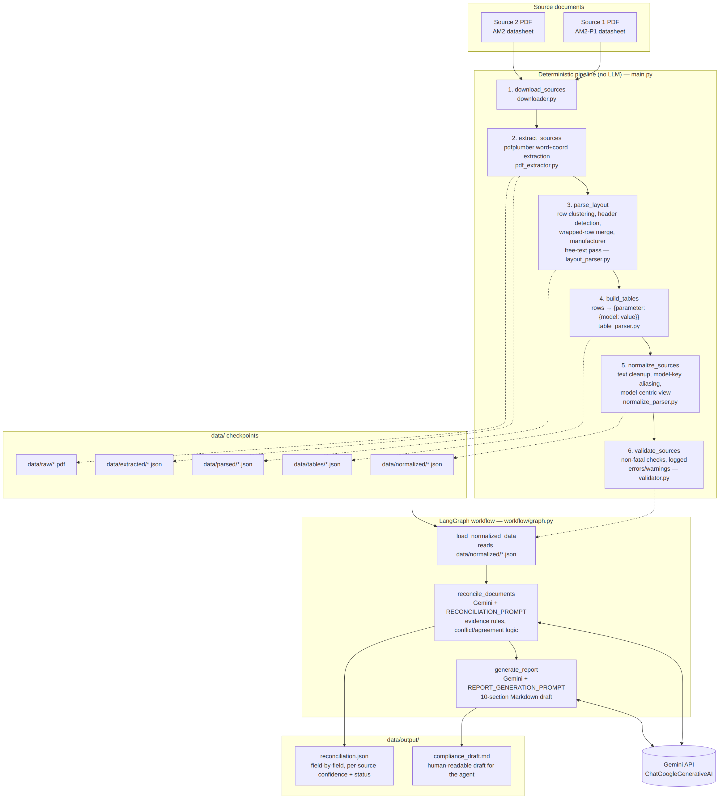

# Cantordust AI Engineer Assessment — Task 1

**SunBridge Trading — China → Nepal import compliance draft**
**Product: SUN-5K-G06P3 (5 kW grid-tied inverter)**

This repo pulls the SUN-5K-G06P3 facts out of two Deye manufacturer
datasheets that don't fully agree, reconciles them field by field, and
generates the draft document SunBridge would hand to its import agent —
showing agreements, conflicts, source-only fields, and anything that's
still unclear.

Sources (fetched by the pipeline, not hardcoded from memory):

- Source 1 — AM2-P1 variant datasheet:
  `datasheet_sun-4-12k-g06p3-eu-am2-p1_231007_en.pdf`
- Source 2 — AM2 variant datasheet:
  `datasheet_sun-4-15k-g06p3-eu-am2_240318_en.pdf`

## How to run it

Requirements: Python 3.12, [uv](https://docs.astral.sh/uv/), and a Gemini
API key.

Create a .env file  and set ``` GEMINI_API_KEY=<your key>``` in .env

You can get free api key from Google AI Studio.


The Gemini model name is set in `workflow/nodes.py`
  (`get_gemini`); confirm it matches the model available on your API key
  before running.


```bash
uv sync
uv run python main.py
```

`main.py` runs the whole thing end to end: download, extract, parse,
normalize, validate, reconcile, report. Every stage checkpoints to disk
under `data/`, and each step is skipped if its output already exists, so
re-running after an interruption (or after only editing a later stage)
picks up where it left off rather than re-downloading or re-parsing PDFs
that haven't changed. Delete the relevant file/folder under `data/` to
force a stage to redo its work.

Outputs land in `data/output/`:

- `reconciliation.json` — the structured, field-by-field comparison
- `compliance_draft.md` — the human-readable draft for the import agent

## Pipeline structure

```
[1] download_sources     fetch both PDFs from the manufacturer URLs
[2] extract_sources      pdfplumber: word-level text + x/y coordinates per page
[3] parse_layout         reconstruct the spec table from word coordinates
[4] build_tables         turn the reconstructed layout into {parameter: {model: value}} rows
[5] normalize_sources    clean encoding artifacts, resolve model-key aliases, build a
                          model-centric view
[6] validate_sources     sanity-check models/parameters/values; non-fatal, logged and
                          carried forward
[7] LangGraph workflow   load_data → reconcile → generate_report  (Gemini)
```

Steps 1–6 are deterministic Python (no LLM involved), they turn two PDFs
into two clean, comparable JSON documents. Step 7 is a 3-node LangGraph
graph (`workflow/graph.py`) that hands those two normalized JSON documents
to Gemini for the parts that need judgment: deciding whether a difference
is a real technical conflict or just a formatting difference, and writing
the final narrative draft. The reconciliation and report prompts
(`workflow/prompt.py`) are deliberately strict about evidence discipline,
no outside knowledge, no inventing or estimating values, no borrowing a
value from another model in the table, kW vs kVA never treated as
equivalent, and a standard being *listed* is never treated as proof of
*certification*.

## Architecture



For the interactive Mermaid version, see the [full architecture diagram](architecture.md).
You need to install Mermaid preview VSCode extension to preview live version.

## Extraction approach, and why

Both PDFs are text-layer datasheets (not scans), so OCR isn't needed —
`pdfplumber.extract_words()` returns real character positions directly.

The technical spec table itself isn't extracted with pdfplumber's built-in
table detector. These datasheets lay out an 8-model comparison table with
inconsistent row heights and values that visually wrap across multiple
lines, which trips up generic table detection. Instead, `layout_parser.py`
does its own reconstruction from raw word coordinates:

1. Cluster words into visual rows by `top` coordinate (`cluster_rows`).
2. Find the row containing all 8 model-number headers, and use each
   header's horizontal center as that column's anchor.
3. Merge rows that are really one wrapped field split across multiple
   lines back into a single logical row (`merge_wrapped_rows`) — this
   handles both a label sitting alone on its own line, and a value that
   starts on one line and spills onto further lines.
4. Assign every value token to its nearest model column by x-position,
   flagging collisions or partial rows rather than guessing silently.

Manufacturer legal name / address is handled as a **separate** pass
(`extract_manufacturer_info`) over the free text of every page, not the
table region. It lives in ordinary footer text in this document family,
so the table-row parser structurally never sees it — extracting it
required its own regex-based line search, and it's marked as
`extraction_method: "footer_free_text_regex"` with low confidence rather
than folded into the table data as if it were a labeled field.

## Structured output & source attribution

`data/output/reconciliation.json` gives, per field: the value from
Source 1, the value from Source 2, a confidence tag for each
(`high` / `low`), and a status (`agreement`, `conflict`, `source_1_only`,
`source_2_only`, `uncertain`). Manufacturer identity is included as its
own field even though it isn't part of the per-model table, and is always
capped at `low` confidence since it comes from a regex scan rather than a
labeled cell. Earlier stages (`data/parsed/`, `data/tables/`,
`data/normalized/`) preserve intermediate confidence/flag information per
row (`per_model_columnar`, `spanning_or_partial`, `merged_wrapped_continuation`,
etc.) so a value's provenance can be traced back through the pipeline, not
just asserted in the final JSON.

## Important extraction issue found and fixed
 
### Wrapped value lines were being dropped/truncated
 
During validation of the reconciliation output, a false conflict was found
in **Grid Connection Standard / Grid Regulation**.
 
The reconciliation initially reported:
 
| Source 1                       | Source 2                               | Status   |
| ------------------------------ | --------------------------------------- | -------- |
| IEC 61727, IEC 62116, EN 50549 | OVE-Richtlinie R25, G99, VDE-AR-N 4105  | conflict |
 
However, Source 2's PDF contains the complete value as a single wrapped
field:
 
```text
IEC 61727, IEC 62116, CEI 0-21, EN 50549, NRS 097, RD 140,
UNE 217002, OVE-Richtlinie R25, G99, VDE-AR-N 4105
```
 
Therefore, Source 2 is a **superset of Source 1 rather than a
contradiction**. The original parser had captured only the second physical
line, silently dropping the first part of the standards list.
 
This was particularly important because the dropped values included
`IEC 61727`, `IEC 62116`, and `EN 50549`, which are directly relevant to the
reconciliation.
 
### Root cause
 
The original `merge_wrapped_rows()` handled a row where a label appeared on
its own line followed by a value row, but did not correctly handle the case
where:
 
1. a row already contained both a label and the first part of its value; and
2. one or more following rows contained continuation text with no new
   label.
As a result, a multi-line field such as `Grid Regulation` could be
truncated during layout parsing or subsequent row processing.
 
The downstream `table_parser.merge_parameterless_value_rows()` also had a
merge-back condition that expected the previous row to have no value yet.
That assumption does not hold when the first physical row already contains
the label and a partial value.
 
### Fix
 
`merge_wrapped_rows()` was rewritten to continue absorbing follow-on
value-only rows when they are likely continuations of the current field.
 
A new `looks_like_continuation()` heuristic was added. It considers factors
such as token count and the proportion of non-numeric tokens to distinguish
wrapped prose or standards lists from genuine per-model value rows.
 
This allows the parser to handle values wrapping across two or more
physical lines while reducing the risk of incorrectly merging separate
table rows.
 
The fix was verified with synthetic word-level data reproducing the
multi-line `Grid Regulation` structure. The complete standards list is now
reconstructed as a single field, and the manufacturer footer extraction was
also verified.
 
Because the pipeline checkpoints intermediate results to disk, a full
re-run after parser changes requires deleting the affected cached outputs
under `data/parsed/`, `data/tables/`, and `data/normalized/`, or otherwise
forcing those stages to regenerate, before checking the new reconciliation
and compliance draft.

## Assumptions

- "The 5 kW model" = `SUN-5K-G06P3`, per the client brief; both sources
  are 8-model family datasheets and only this column is reconciled.
- The two datasheets share the same 8-model table structure (same column
  count, same row ordering conventions); this is checked
  (`EXPECTED_MODEL_COLUMNS = 8`) and warned about, not silently assumed,
  if a future document doesn't match.
- IP-rating / phrasing / spacing differences (e.g. "IP65" vs "IP 65") are
  presentation differences, not conflicts; genuinely different units or
  terminology (e.g. kW vs kVA) are always kept as real conflicts.
- A standard being listed in a datasheet is not treated as proof of
  certification — only explicit certification evidence would count, and
  neither source provides any.
- Manufacturer identity is taken only from the automated footer-text
  search, not inferred from domain knowledge of who Deye is.

## What I'd do with more time

- Add a vision/OCR fallback (e.g. render the page and use a multimodal
  call) for datasheets that turn out to be scanned images rather than
  text-layer PDFs.
- Move the Gemini reconciliation/report steps off "ask nicely for JSON in
  the prompt + strip code fences" and onto structured output / tool
  calling, so a malformed response doesn't kill the whole run.
- Add retries/backoff around the Gemini calls, and unit tests for the
  layout parser's row-merging logic against a few more datasheet
  variants.
- Either actually use `pymupdf` (currently an unused dependency) as a
  cross-check against the pdfplumber extraction, or drop it.
- Numeric-aware comparison (e.g. tolerate `97.5%` vs `97.50%`) instead of
  string-level matching for the conflict/agreement classification.

## Known limitations

- **Layout parser is tuned to this specific datasheet family.** The
  coordinate thresholds and the 8-column expectation reflect Deye's
  current layout; a differently formatted datasheet will need those
  constants revisited, though the pipeline does warn rather than fail
  silently when the model-column count doesn't match.
- **Manufacturer extraction is best-effort regex over free text**, not a
  labeled field — it's explicitly kept at low confidence for this reason,
  and a differently worded footer could miss it entirely (`found: false`).
- **LLM output parsing is string-based** (fence-stripping + `json.loads`),
  not enforced via a schema/tool-call contract, so an unusual Gemini
  response can raise instead of degrading gracefully.
- **Validation is non-fatal by design** — `validate_sources()` logs
  errors/warnings and still lets the run continue, so a badly parsed PDF
  can still produce a confident-looking draft. Always check the
  reconciliation JSON and the source PDFs before this goes to the agent.
- **No automated tests** are included given the 48-hour window.
- The Gemini model name is set in `workflow/nodes.py`
  (`get_gemini`); confirm it matches a model available on your API key
  before running.
- Known-synonym terminology can produce a false conflict. In this
  run, Source 1 reports Transformerless while Source 2 reports
  Non-Isolated under topology. Both terms genuinely appear in the
  source PDFs, so this is not an extraction error; however, they are
  commonly used as synonymous descriptions of inverter topology. The
  reconciliation correctly treats formatting-only differences such as
  IP65 vs IP 65 and 4000m vs 4000 m as agreements, but it does not
  yet apply the same normalization to known technical synonym pairs.
  This should therefore be treated as a likely false conflict and
  reviewed by a human rather than assumed to represent a technical
  contradiction.
- Adjacent fields can be merged during layout reconstruction.
  Cooling Concept is reported as Free Cooling Smart Cooling in
  Source 1, while Source 2 reports Natural Cooling. The raw Source 1
  layout shows Cooling Concept: Free Cooling and a separate
  Smart Cooling feature nearby, so the combined value may be a
  row/field-clustering artifact rather than a single source value.
  This cannot be confirmed reliably from the flattened text output
  alone because text order does not fully represent the original visual
  table structure. The corresponding PDF page should be spot-checked
  before treating this as a genuine conflict.
## Disclaimer

`compliance_draft.md` is an AI-assisted draft generated for review. It is
not a final legal, customs, engineering, or regulatory determination —
per the report prompt, it's explicitly marked as a draft and does not
make a final clearance decision on SunBridge's behalf.