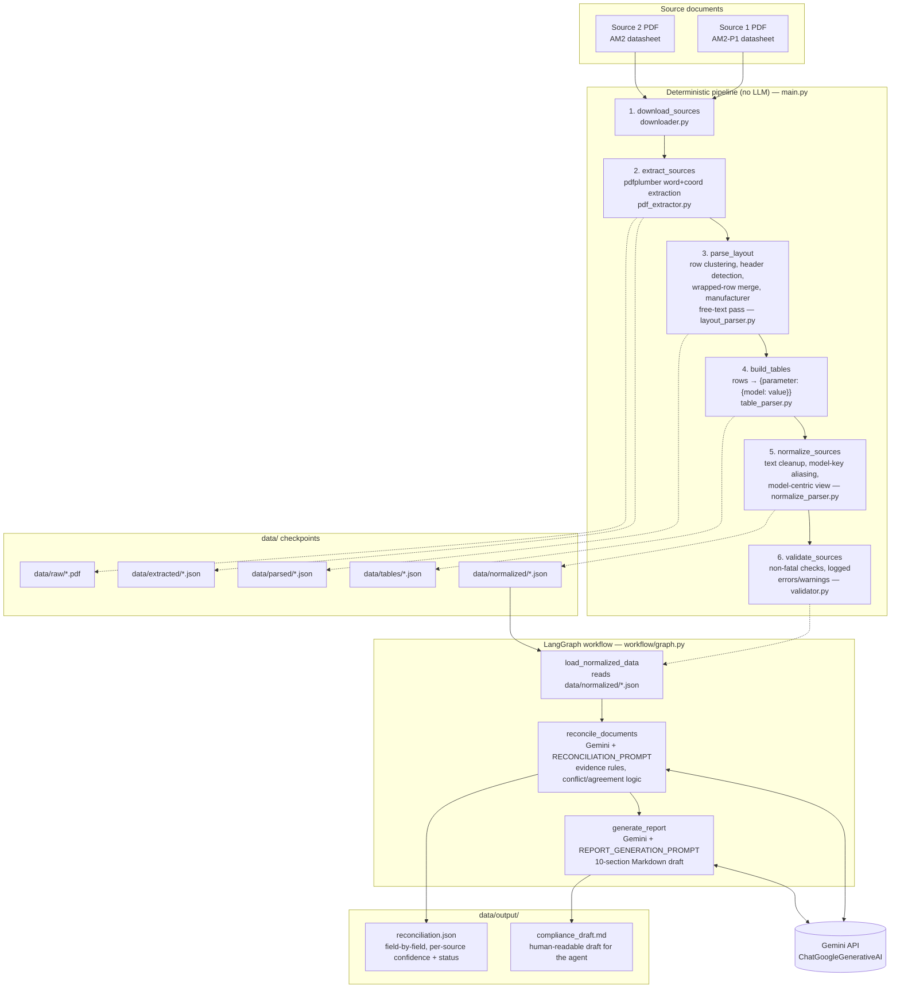

```mermaid
flowchart TD
    subgraph SRC["Source documents"]
        S1["Source 1 PDF<br/>AM2-P1 datasheet"]
        S2["Source 2 PDF<br/>AM2 datasheet"]
    end

    subgraph DET["Deterministic pipeline (no LLM) — main.py"]
        direction TB
        DL["1. download_sources<br/>downloader.py"]
        EX["2. extract_sources<br/>pdfplumber word+coord extraction<br/>pdf_extractor.py"]
        LP["3. parse_layout<br/>row clustering, header detection,<br/>wrapped-row merge, manufacturer<br/>free-text pass — layout_parser.py"]
        TB["4. build_tables<br/>rows → {parameter: {model: value}}<br/>table_parser.py"]
        NM["5. normalize_sources<br/>text cleanup, model-key aliasing,<br/>model-centric view — normalize_parser.py"]
        VL["6. validate_sources<br/>non-fatal checks, logged<br/>errors/warnings — validator.py"]

        DL --> EX --> LP --> TB --> NM --> VL
    end

    subgraph DATA["data/ checkpoints"]
        D1["data/raw/*.pdf"]
        D2["data/extracted/*.json"]
        D3["data/parsed/*.json"]
        D4["data/tables/*.json"]
        D5["data/normalized/*.json"]
    end

    subgraph LG["LangGraph workflow — workflow/graph.py"]
        direction TB
        N1["load_normalized_data<br/>reads data/normalized/*.json"]
        N2["reconcile_documents<br/>Gemini + RECONCILIATION_PROMPT<br/>evidence rules, conflict/agreement logic"]
        N3["generate_report<br/>Gemini + REPORT_GENERATION_PROMPT<br/>10-section Markdown draft"]

        N1 --> N2 --> N3
    end

    subgraph OUT["data/output/"]
        O1["reconciliation.json<br/>field-by-field, per-source confidence + status"]
        O2["compliance_draft.md<br/>human-readable draft for the agent"]
    end

    S1 --> DL
    S2 --> DL
    EX -.-> D1
    EX -.-> D2
    LP -.-> D3
    TB -.-> D4
    NM -.-> D5
    VL -.-> N1
    D5 --> N1
    N2 --> O1
    N3 --> O2

    GEMINI[("Gemini API<br/>ChatGoogleGenerativeAI")]
    N2 <--> GEMINI
    N3 <--> GEMINI
```